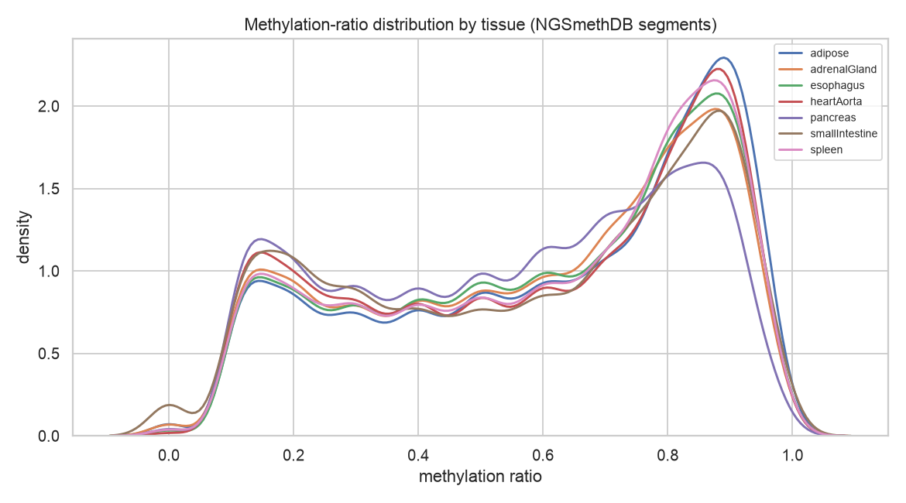
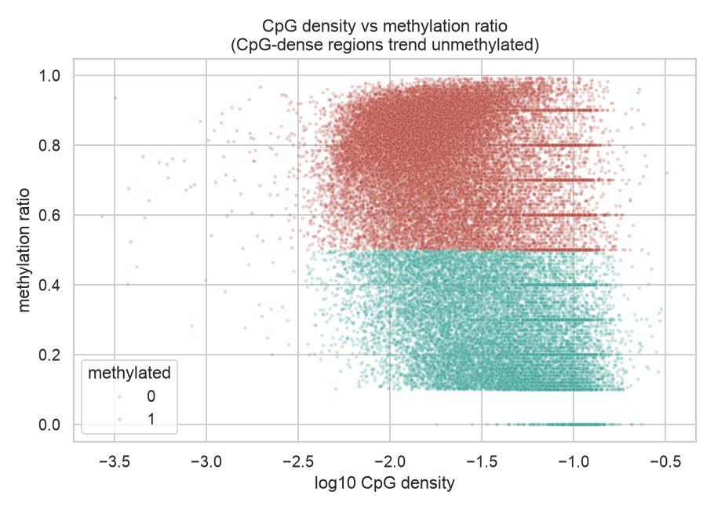
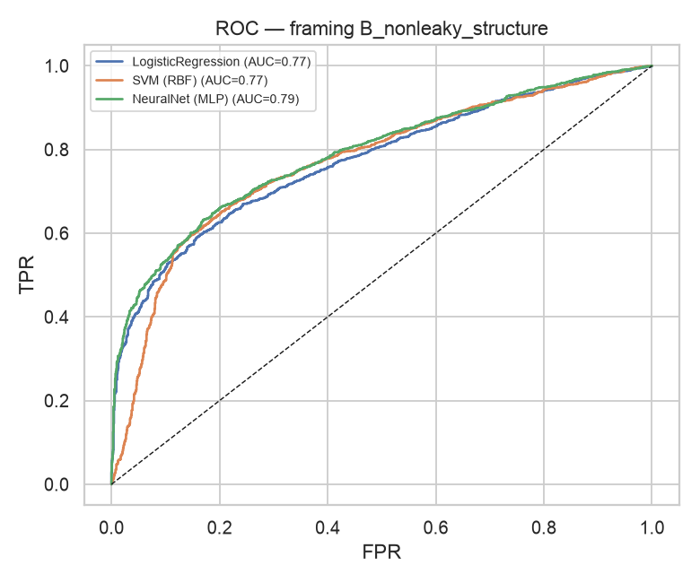

# CpGMAP — Predicting DNA Methylation Status Across Human Tissues

> Methylation switches genes off. CpGMAP asks a simple question: from a stretch of
> DNA, can a machine-learning model tell whether it is methylated (silenced) or not —
> and does the answer change from tissue to tissue?

CpGMAP began as my final-year Bioinformatics project (a desktop app + ML model) and
is rebuilt here as a clean, reproducible analysis. It classifies the **methylation
status of CpG segments** across **seven human tissues**, using real whole-genome
bisulfite-sequencing data from **NGSmethDB**.

**Stack:** Python (pandas, scikit-learn) · R (neuralnet, e1071) · real WGBS data


`Quick start` · `Data` · `Method` · `Results` · `The original project`

---

## 💡 The idea

DNA methylation adds a methyl group to cytosines in CpG dinucleotides. When a gene's
promoter is methylated, the gene is usually **switched off** — so methylation is a key
layer of epigenetic gene regulation, and it differs between tissues. Tools at the time
either *found* CpG islands **or** *predicted* methylation, and were not tissue-specific.
CpGMAP set out to predict tissue-specific methylation status from sequence-derived
features.

## ✨ What this repo contains

- A **modern Python analysis** (`python/`) that loads 7 tissue methylomes, explores
  them, and trains/evaluates classifiers — the current, reproducible version.
- The **original R model rebuilt** (`r/`) for the record (neural network + SVM).
- The **real datasets** (`data/`), with full provenance and citations.
- A write-up of the **original desktop application** and project documentation
  (`docs/`).

## 🚀 Quick start

```bash
# 1. create the environment
conda env create -f environment.yml && conda activate cpgmap
# 2. run the analysis (loads data/raw, trains models, writes results/)
python python/cpgmap_analysis.py
```

Outputs (figures + `metrics.json`) are written to `results/`.

## ✅ Tests

The analysis logic is unit-tested (16 tests, run on every push via GitHub Actions):

```bash
pip install pytest && pytest -q     # 16 passed
```

Tests cover BED parsing, every feature transform, the methylation-label rule and its
boundary, the **no-data-leakage** guarantee (Model B never sees `methRatio`/`score`),
model fit/score, reproducibility, and an end-to-end run on synthetic segments. R feature
functions have matching `testthat` tests in `r/tests/`. *(These tests caught a real
off-by-one bug in the BED parser during development.)*

## 🧬 Data

Seven human-tissue **methylation segments** from **NGSmethDB** (WGBS, single-cytosine
resolution; underlying methylomes from Roadmap Epigenomics): adipose, adrenal gland,
esophagus, heart aorta, pancreas, small intestine, spleen. Full format and citations
are in [`data/README.md`](data/README.md).

## 🔬 Method (two honest framings)

A segment is labelled **methylated** if its methylation ratio ≥ 0.5. The same label is
modelled two ways, on purpose:

- **Model A — reference (leaky).** Features include the methylation ratio itself, which
  *is* the label in disguise. It scores near-perfectly and is shown only to reproduce
  the original 2018 model and to make the leakage explicit.
- **Model B — the real task (non-leaky).** Features describe **region structure only**
  — segment length, cytosine count, and CpG density — never the methylation value.
  This is the honest, biologically meaningful task: CpG-dense regions (CpG islands)
  tend to stay unmethylated, so structure carries genuine signal.

Each framing compares **Logistic Regression**, an **SVM (RBF)**, and a small
**neural network (MLP)**, with a stratified train/test split.

## 📊 Results

Across **429,484 methylation segments** from 7 tissues (64.2% methylated overall — the
majority-class baseline to beat).

**Model B — the honest task** (structure-only features, no leakage):

| Model | Accuracy | ROC-AUC |
|---|---|---|
| Logistic Regression | 0.698 | 0.773 |
| SVM (RBF) | 0.713 | 0.769 |
| **Neural network (MLP)** | **0.716** | **0.789** |

The neural net reaches **71.6% accuracy / 0.79 AUC — clearly above the 64.2% baseline**,
confirming that CpG density and region structure genuinely predict methylation status
(CpG-dense islands trend unmethylated).

**Model A — leaky reference** (features include the methylation value itself): every
model scores **~0.999 accuracy / AUC 1.00**, included only to reproduce the original
2018 model and to make the leakage unmistakable.

Methylation also varies by tissue (60.6% methylated in pancreas → 67.1% in adipose).





**Takeaway:** structure alone gets well above chance, but the gap to the leaky model is
exactly why true sequence features (k-mers, TF-binding motifs), as in the literature,
are the next step for a production-grade predictor — the honest limitation, and the
roadmap.

## 🖥️ The original project (2018–19)

The final-year project was a **Windows desktop application** (C# WinForms, Entity
Framework + SQL Server) with login, registration, sequence-input and output screens,
backed by an R/ML methylation classifier. It was a 3-person group project that I
**led**, covering the full software lifecycle (requirements, design, implementation).
The requirements, use-case and design documents are summarised in [`docs/`](docs/).

## ⚠️ Limitations & next steps

- The methylation label is a 0.5 threshold on a continuous ratio; a regression or
  multi-class framing would be richer.
- Features are region-structural, not true sequence features. Adding k-mer composition
  and TF-binding-site features (as in MethCGI / MethFinder) is the clear next step.
- Tissue is currently pooled; per-tissue and cross-tissue transfer analyses would test
  how tissue-specific methylation really is.

## 📚 Cite the data
NGSmethDB — Hackenberg et al., *Nucleic Acids Research* 2011 (doi:10.1093/nar/gkq942);
Lebrón et al., *NGSmethDB 2017*, NAR 2016 (doi:10.1093/nar/gkw996).

## License
MIT — see [LICENSE](LICENSE).
